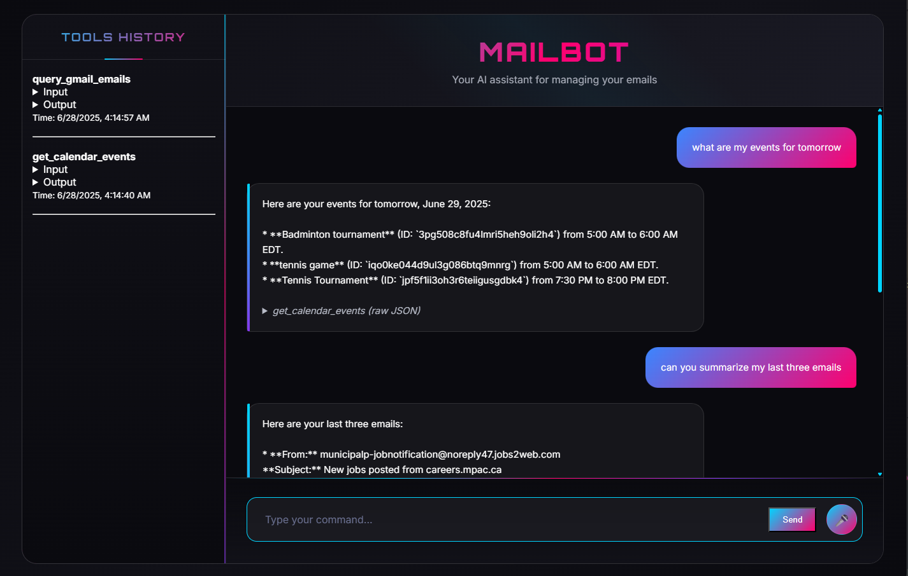

## Interactive Web Interface that uses Gemini and integrates the [Gsuite MCP server](https://github.com/MarkusPfundstein/mcp-gsuite) (as of currently; will have custom server in the future)



### Features

-   **Natural Language Interface**: Control your Google Workspace with plain English commands.
-   **AI-Powered Tool Selection**: Uses Google Gemini to intelligently determine which Gsuite tool to use based on 
request.
-   **User-Friendly Summaries**: Tool outputs are summarized by the LLM for clarity.
-   **Tool History**: A side panel shows a history of all tool calls, including inputs, outputs, and time.
-   **Voice Input**: Supports hands-free operation using the Web Speech API.
-   **Modern UI**: A sleek, responsive interface with a futuristic theme.
- **Additional Feature**: Includes a time scheduler for calendar events based on vague descriptions of tasks/events within specified time ranges (not part of the gsuite MCP).

### How It Works

The application consists of two main components:

1.  **MCP Server (`/server`)**: A FastAPI server that wraps the `mcp-gsuite` package, exposing Gmail & Google Calendar tools over a REST API.
2.  **Web Client (`/app`)**: A Flask application that serves the frontend. When a user sends a message:
    -   The request is sent to the Flask backend.
    -   The backend uses the Gemini API, providing the user's request and the list of available tools.
    -   Gemini determines the correct tool to call and the arguments to use.
    -   The Flask app calls the FastAPI server to execute the tool.
    -   The raw result from the tool is sent back to Gemini to be summarized.
    -   The final, user-friendly summary is displayed in the chat interface.

### Technologies Used

-   **AI / LLM**: Google Gemini
-   **Backend**: Python, Flask, FastAPI
-   **Frontend**: HTML, CSS, JavaScript
-   **Tool Integration**: MCP

### Setup and Usage

1.  **Prerequisites**:
    - Google Cloud credentials configured in `server/` for `mcp-gsuite`. See [this link](https://github.com/MarkusPfundstein/mcp-gsuite).
    - In the root directory, create a file named `.env` with the following contents
    
     ```dotenv
     LLM_API_KEY="YOUR_GEMINI_API_KEY"
     LLM_MODEL="YOU_GEMINI_MODEL"
     MCP_SERVER_URL="URL_TO_RUN_THE_SERVER"
     ```
2.  **Run the MCP Server**:
    Open a terminal in the project root and run:
    ```bash
    ./run_server.sh
    ```
3.  **Run the Web Client**: Open a second terminal in the project root and run:
    ```bash
    ./run_client.sh
    ```
4.  **Access the Application**: Navigate to the URL provided by the Flask application (usually `http://127.0.0.1:5000`).
